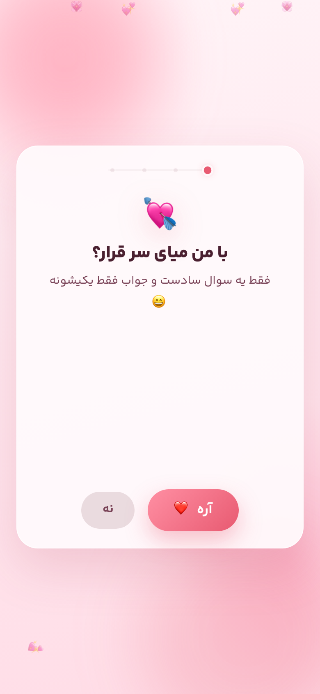
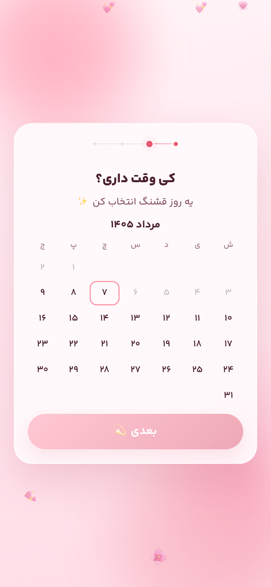
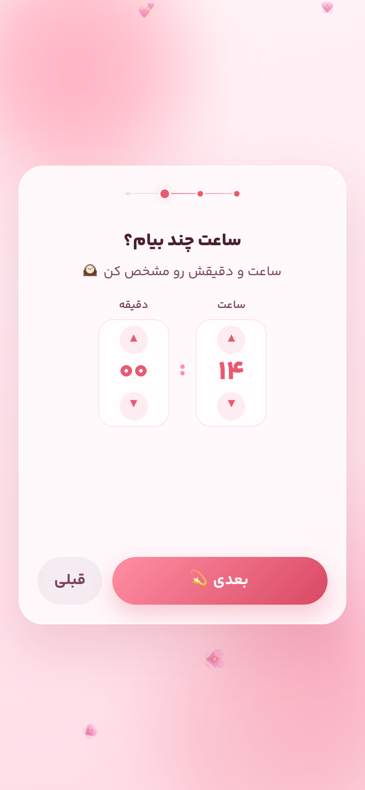
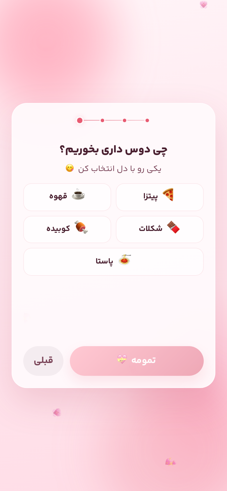
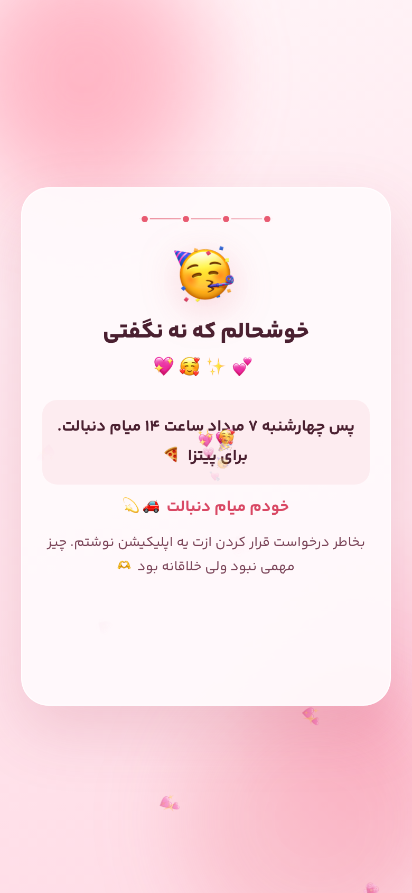

# Date Invite App

### A playful Persian web app for asking someone out — beautifully.

<p align="center">
  
</p>

<p align="center">
  <strong>Mobile-first · RTL · Jalali calendar · Framer Motion</strong>
</p>

<p align="center">
  <a href="#-preview"></a>
  <a href="#-tech-stack"></a>
  <a href="#-getting-started"></a>
  
</p>

---

A soft, romantic multi-step experience designed for phones. Ask the big question, pick a Persian calendar day, choose a time and a meal, then celebrate with a personal summary — all wrapped in blush tones, floating hearts, and delightful micro-interactions.

> Built as a creative “will you go on a date with me?” moment. Simple idea. Thoughtful craft.

---

## ✨ Preview

<table>
  <tr>
    <td align="center" width="20%">
      <br />
      <sub><b>1. The question</b></sub>
    </td>
    <td align="center" width="20%">
      <br />
      <sub><b>2. Pick a day</b></sub>
    </td>
    <td align="center" width="20%">
      <br />
      <sub><b>3. Choose a time</b></sub>
    </td>
    <td align="center" width="20%">
      <br />
      <sub><b>4. Pick the food</b></sub>
    </td>
    <td align="center" width="20%">
      <br />
      <sub><b>5. Celebrate</b></sub>
    </td>
  </tr>
</table>

<details>
  <summary><b>Open larger screenshots</b></summary>
  <br />
  <p align="center">
    
    &nbsp;
    
  </p>
  <p align="center">
    
    &nbsp;
    
  </p>
  <p align="center">
    
  </p>
</details>

---

## 💖 Features

- **Playful “Yes / No” opener** — every “No” shrinks; “Yes” grows until the answer is obvious
- **Jalali (Persian) calendar** — current-month picker with past days locked
- **Hour & minute wheels** — fast, tactile time selection
- **Emoji food choices** — pizza, coffee, chocolate, kebab, pasta
- **Celebration finale** — animated confetti + a personal summary of the plan
- **Subtle step indicator** — delicate progress line at the top of the card
- **RTL-first UI** — YekanBakhFaNum typography, Persian copy throughout
- **Romantic atmosphere** — blush gradients and floating background hearts behind the card

---

## 🛠 Tech Stack

| Layer | Choice |
| --- | --- |
| Framework | [Next.js 16](https://nextjs.org) (App Router) |
| UI | React 19 · TypeScript |
| Styling | Tailwind CSS v4 · custom CSS |
| Motion | Framer Motion |
| Icons | Lucide React |
| Calendar | Custom Jalali helpers (`lib/jalali.ts`) |
| Font | YekanBakhFaNum (local) |

---

## 🚀 Getting Started

### Prerequisites

- Node.js 18+
- npm (or yarn / pnpm / bun)

### Install & run

```bash
npm install
npm run dev
```

Open [http://localhost:3000](http://localhost:3000) on your phone or a narrow browser viewport for the best feel.

### Production

```bash
npm run build
npm start
```

---

## 🗂 Project Structure

```text
app/                     # Next.js app entry, layout, theme
components/invite/
  steps/                 # Ask · Date · Time · Food · Celebrate
  calendar/              # Persian month calendar
  time/                  # Hour / minute wheels
  food/                  # Food option grid
  celebrate/             # Confetti + summary
  ui/                    # Shared primitives & step indicator
hooks/                   # Invite flow & calendar state
lib/
  jalali.ts              # Jalali conversion & calendar math
  invite/                # Types, constants, formatters
docs/screenshots/        # README preview images
public/fonts/            # YekanBakhFaNum
```

---

## 🧭 Flow

```text
Ask  →  Date  →  Time  →  Food  →  Celebrate
 💘      📅       ⏰      🍽         🥳
```

1. **Ask** — “با من میای سر قرار؟”
2. **Date** — choose a day in the current Jalali month
3. **Time** — set hour and minute
4. **Food** — pick what you’ll eat
5. **Celebrate** — summary, pickup line, and a little love note

---

## 🎨 Design Notes

- Soft rose / blush palette — romantic without being heavy
- Compact card layout tuned for modern phone screens
- Background emoji motion stays **behind** the card
- Progress UI stays quiet so the content can lead

---

## 📄 License

Private / personal project unless otherwise noted. Feel free to fork for your own creative invite.

---

<p align="center">
  <sub>Made with care · چیز مهمی نبود ولی خلاقانه بود 🫶</sub>
</p>
